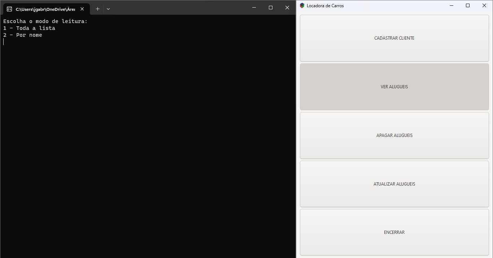

# Movida-locadora-de-carros



> Programa em C que realiza um CRUD(Create, Read, Update, Delete), onde foi implementada uma interface gráfica feita com GTK, para dar mais dinâmica e facilidade na utilização.

### Ajustes e melhorias

O projeto ainda está em desenvolvimento e as próximas atualizações serão voltadas nas seguintes tarefas:

- [x] Criar funcionalidades do CRUD
- [x] Criar interface
- [x] Linkar interface ao CRUD
- [ ] Implementar mais design e interface
- [ ] Melhorar funcionalidades

## 💻 Pré-requisitos

Antes de começar, verifique se você atendeu aos seguintes requisitos:

- Você instalou os `<compilador de C / GTK / python e tkinter>`
- [Como instalar o GTK](https://www.gtk.org/docs/installations/windows).
- Indique os caminhos dos compiladores nas variáveis de ambiente, em patch.

## 🚀 Instalando <nome_do_projeto>

Para instalar o <movida-locadora-de-carros>, siga estas etapas:

Windows:

1º: Baixe os arquivos do programa

2º: Se for usar o utilizar o VsCode `<Recomendo executar diretamente no MSYS2, como informarei abaixo>`, não esqueça de mudar
os caminhos do arquivo e compilador no arquivo `<tasks.json>`, `<launch.json>`, `<c_cpp_properties.json>`

3º: Após todas as intalações de compiladores de forma correnta, execute no `<MSYS2 MINGW64>`

`<ALTERE O CAMINHO DO ARQUIVO NO COMANDO, COMO INDICADO>`

```
<gcc -Wall -Wextra -g3 -o "caminho_do_arquivo/main.exe" "caminho_do_arquivo/main.c" pkg-config --cflags --libs gtk+-3.0>
```
4º: Após isso será carregado o arquivo main.exe, no caminho onde você direcionou, execute ele e estará pronto para uso.

## ☕ Usando <movida-locadora-de-carros>

Para usar <movida-locadora-de-carros>, siga estas etapas:

```
<Clique no botão de acordo com a função desejada e execute as funções no prompt de comando>
```

## 🤝 Colaborador

Agradecemos às seguintes pessoas que contribuíram para este projeto:

<table>
  <tr>
    <td align="center">
      <a href="https://www.linkedin.com/in/jo%C3%A3o-gabryel-santos-pereira-9093b2216/" title="defina o titulo do link">
        <br>
        <sub>
          <b>João Gabryel</b>
        </sub>
      </a>
    </td>
  </tr>
</table>
